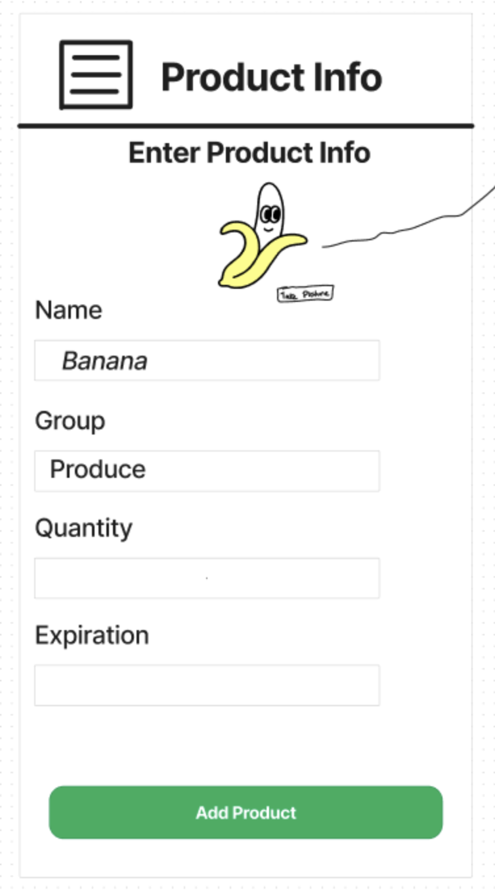

# Module 2 Group Assignment

CSCI 5117, Spring 2022, [assignment description](https://canvas.umn.edu/courses/355584/pages/project-2)

## App Info:

* Team Name: Spirit
* App Name: PantryPro
* App Link: <https://pantrypro.netlify.app/>

### Students

* Runqiu Guo, guo00370@umn.edu
* Daniel Kong, kong0150@umn.edu
* Matthew Letellier, letel005@umn.edu
* Matt Yokanovich, yokan013@umn.eduz

## Key Features

**Describe the most challenging features you implemented
(one sentence per bullet, maximum 4 bullets):**

* OpenAI GPT-4 recipe recommendations which use your current pantry inventory to suggest relevant recipes with ingredients you have handy.
* Pantry item adding supports barcode scanning to allow you to fill in product information just with the scan of a barcode.
* Pantry item adding supports taking images using camera or uploading images.
* Pantry management and recipe  book for allowing the user to store what food they have at home and what recipes they want to make.

Which (if any) device integration(s) does your app support?

* Camera integration for barcode scanning & food image capture

Which (if any) progressive web app feature(s) does your app support?

* Add to home screen - app is a compliant installable PWA without offline features.

## Mockup images

**[Add images/photos that show your mockup](https://stackoverflow.com/questions/10189356/how-to-add-screenshot-to-readmes-in-github-repository) along with a very brief caption:**

### Home Screen (Pantry View)

The main home screen shows the user their pantry items. These items are sorted by expiration date and category.

### Sidebar

The sidebar can be accessed from any page.

### Add new Pantry Item Flow

If the user does not have the camera capability available or declines it, the barcode/photo steps are skipped and the user is brought directly to details (same as if they click "manual entry").

From the manual recipe entry, the user can use "take photo" to go back to the camera and/or upload an image file (on mobile it will use the standard prompt for add images/take picture, on desktop just file upload).

### Recipe Wizard

The recipe wizard page features some pre-made suggestions for types of recipes to generate as well as a prompt input if a user wants to ask for something specific.

When the user clicks on a category or enters a prompt, once the recommender gets back with a suggestion, it will show the suggestion list. Clicking any of these bring the user to the recipe view, where they can view the recipe and save it to their recipe book if they wish.

### Recipe View 

This view supports an inline editor for changing details (it will also be reused for the new recipe flow if a user manually creates a recipe).

### Recipe Book

Clicking on new recipe will bring the user to an empty recipe view with inline edit mode active.

## Testing Notes

**Is there anything special we need to know in order to effectively test your app? (optional):**

* If there are ongoing availability issues with Codehooks, testing can still be done locally with ``coho localserver``.
* All of the functionality for recommendations are using OpenAI. While we have error handling in place, if there is an outage or degraded usability with OpenAI's services, this will result in an experience much different than what we had in place while testing.
  * Additionally, although there are safety guards in place for generating recipes and the assistant will refuse to use ingredients which could be unsafe, the best user experience comes from adding *normal* food ingredients that a legitimate user would have, as otherwise the assistant may refuse to generate recipes based on these safety guards.
* The barcode scanning API has a very limited number of uses on the free tier. We have put a fresh API key on after demo day, but if for some reason a rate-limit is reached, we can replace the key with a new one.

## Screenshots of Site (complete)

**[Add a screenshot of each key page](https://stackoverflow.com/questions/10189356/how-to-add-screenshot-to-readmes-in-github-repository)
along with a very brief caption:**

## External Dependencies

**Document integrations with 3rd Party code or services here.
Please do not document required libraries (e.g., Vue, Vuefire, Firebase).**

* OpenAI: Chat completion API is used with heavily customized system instructions to leverage GPT-3.5/GPT-4 for recipe recommendations.
* [Barcode Lookup](https://www.barcodelookup.com/): Barcode Lookup API is used to grab product information from barcode scanning.
* [Mantine](https://mantine.dev/): This UI framework used within our project, we have additional theming done with Emotion & theme overrides to get a less generic design style. 

**If there's anything else you would like to disclose about how your project
relied on external code, expertise, or anything else, please disclose that
here:**

...
